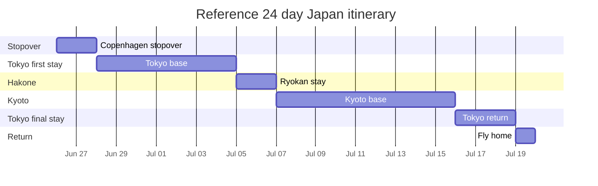
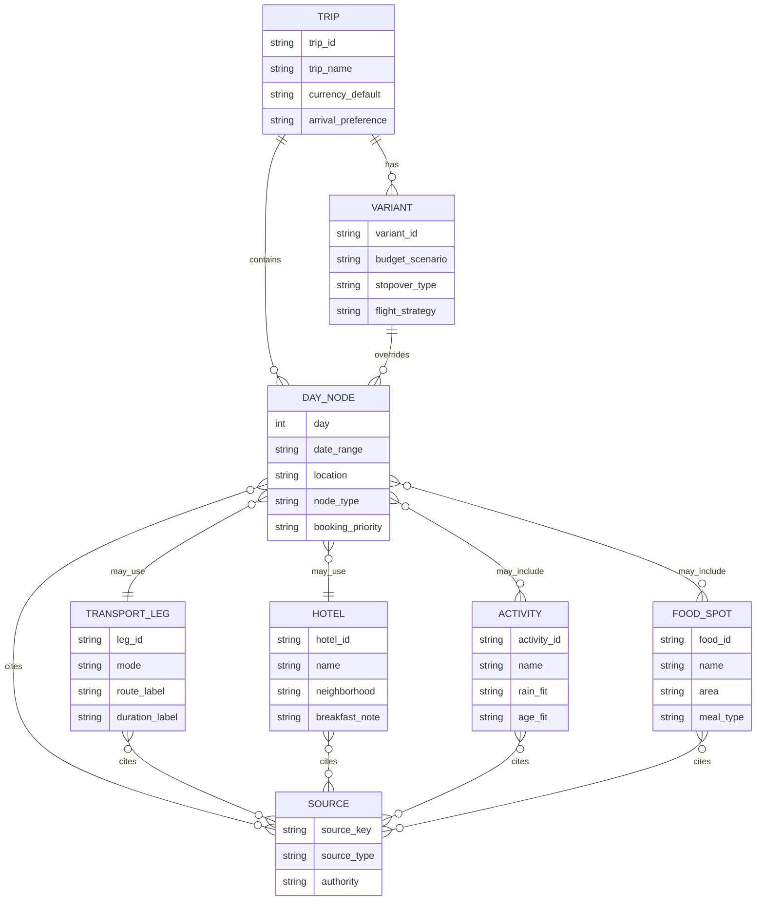

# Interactive Timeline Planning for a Summer 2027 Japan Trip

## Executive summary

For a 3 to 4 week Oslo to Japan trip with your daughter in summer 2027, the strongest planning baseline is **departing roughly June 24 to June 30 and returning roughly July 17 to July 27**. That window sits mostly before Obon, avoids the worst mid August domestic travel crush, and usually lands after the wettest early June stretch while still being earlier than the most oppressive late July and August heat. JNTO says Japan’s rainy season generally runs from early June through mid July, that it does not rain all day every day, and that Obon around August 13 to 16 is one of the busiest domestic travel periods. Current fare trackers for Oslo to Tokyo also show July above June on comparable searches, so the price signal points in the same direction. citeturn10search5turn10search14turn10search1turn10search12turn5search3turn5search5

Your best arrival airport is **Haneda**, not because Narita is unusable, but because Haneda is easier on day one. Tokyo Monorail lists Haneda to Tokyo Station at about 19 minutes and Haneda to Hamamatsucho at about 13 minutes, which makes the first transfer materially lighter after a long flight. citeturn8search0turn8search4

For airline strategy, the most relevant official facts are these: **SAS award seats open up to 330 days before departure**, children ages 2 to 11 get **50 percent off the points price** on SAS award flights, SAS is now aligned with **SkyTeam**, and SAS officially supports **Copenhagen stopovers** through customer service. That makes two booking patterns especially useful: a simpler SAS centered itinerary through Copenhagen, and a premium comfort open jaw via KLM or Air France, with Seoul as the strongest Asia stopover if you want one on the way home. citeturn0search0turn12search0turn0search3turn0search7turn6search3turn11search0turn11search1turn3search2

The practical recommendation is to build the trip around **Tokyo, Hakone, and Kyoto** as the three true bases, use **Hakone ryokan nights with half board** as the emotional splurge, skip driving entirely, and rely on **Haneda airport rail, the Odakyu Romancecar, Hakone Freepass, the Tokaido shinkansen, local subway and JR, and HARUKA if you depart Kansai**. JR Pass is not the value move for this shape of trip. The official 7 day ordinary pass is ¥50,000 for an adult and ¥25,000 for a child, while SmartEX early purchase Nozomi fares are far lower for the one big Tokyo to Kyoto trunk trip. citeturn1search15turn1search3turn1search1turn1search11turn2search8turn2search10

## Timing and routing logic

The weather logic is straightforward. JNTO says June is part of rainy season, July is hot and the rainy season is over in most areas only by the end of July, and August is both hot and tied to heavy domestic movement around Obon. That does not make late June or early July bad, but it does mean your timeline UI should support a **rainy day alternate plan** for Tokyo and Kyoto, especially around indoor attractions such as teamLab Planets, station based food halls, and easy museum or shopping days. citeturn10search0turn10search2turn10search5turn10search14

The routing logic is equally clear. SAS officially markets Tokyo from or via Oslo, Copenhagen, or Stockholm. KLM officially serves Tokyo and Osaka. Air France’s official summer schedule also shows increased Tokyo and Osaka capacity. Korean Air’s official city pair pages confirm Tokyo to Seoul and Osaka to Seoul as easy continuation options, and Korean Air also runs a free transit program for qualifying 4 to 24 hour connections at Incheon. citeturn0search2turn11search0turn11search1turn11search5turn11search2turn11search3turn3search2

With your constraints, stopovers fall into three buckets. **Copenhagen** is the easiest SAS aligned stopover and the lowest friction option. **Seoul** is the most meaningful Asia stopover because it adds very little detour once you are already in Japan. **Amsterdam or Paris** are best treated as elegant one to two night city add ons if you are leaning into KLM or Air France and are comfortable prioritizing comfort over absolute simplicity. Premium cabin value is strongest on KLM Premium Comfort and Air France Premium, both of which have materially more space than economy. KLM cites a quiet dedicated cabin, up to 18 cm more legroom than standard economy, and 97 cm legroom in its class comparison pages. Air France cites 96 cm of legroom in Premium. citeturn6search3turn3search2turn3search0turn3search17turn3search1

The no driving requirement is easy to honor. The core Japan spine is already built for it. Odakyu says the Romancecar takes about 80 minutes directly from Shinjuku to Hakone Yumoto, all seats are reserved, and the Hakone Freepass covers unlimited rides on eight transport modes. JR West confirms HARUKA provides direct access between Kansai Airport and Kyoto. citeturn1search15turn1search3turn1search12turn2search8turn2search10

## Budget scenarios and itinerary variants

The four strongest variants below assume **24 days** as the reference length because it fits cleanly inside your sweet spot while still feeling like a real 3 to 4 week trip.

| Variant | Flight logic | Core stays | Stopover logic | Best use case | Modeled total for two |
|---|---|---|---|---|---|
| Value airport connection only | OSL > CPH > HND, return HND > CPH > OSL on SAS or SAS aligned itinerary | Tokyo, Hakone, Kyoto, short Tokyo return | No intentional overnight stopover | Simplest booking, best EuroBonus fit | **50 to 60K NOK** |
| Value with Copenhagen stopover | OSL > CPH stop 2 nights > HND, return HND > CPH > OSL | Copenhagen, Tokyo, Hakone, Kyoto, short Tokyo return | One low stress Europe stopover | Best balance of special feel and low friction | **55 to 60K NOK** |
| Premium airport connection only | OSL > AMS or CDG > HND, return KIX > AMS or CDG > OSL | Tokyo, Hakone, Kyoto | No overnight stopover, one upgraded long haul | Best comfort to complexity ratio | **100 to 115K NOK** |
| Premium with meaningful stopover | OSL > CPH > HND, Japan > Seoul 3 nights, ICN > Europe > OSL | Tokyo, Hakone, Kyoto, optional Osaka, Seoul | One Asia stopover on the way home | Best “special trip” memory density | **105 to 120K NOK** |

For the **value stack**, the strongest named hotel set is **JR East Hotel Mets Premier Akihabara** in Tokyo, **Hakone Kowakien Ten yū** in Hakone, and **Hotel Vischio Kyoto by Granvia** in Kyoto. JR East Hotel Mets Premier Akihabara officially offers buffet or café breakfast and sits about one minute from Akihabara Station. Hakone Kowakien Ten yū says all rooms have a private open air bath and the property strongly positions dinner and breakfast as part of the stay. Hotel Vischio Kyoto is steps from Kyoto Station and advertises a breakfast buffet of more than 100 Japanese and Western items. citeturn4search6turn4search2turn4search14turn4search3turn4search7turn4search15turn13search5turn13search3

For the **premium stack**, the most coherent trio is **Tokyo Station Hotel** in Tokyo, **Hakone Kowakien Ten yū** in Hakone, and **Hotel Granvia Kyoto** in Kyoto. Tokyo Station Hotel’s breakfast page describes roughly 100 items. Hotel Granvia Kyoto has family rooms that can take up to five guests, which matters if you want roomier layouts and a simpler in station base. citeturn4search0turn4search20turn4search1turn4search9turn4search3turn4search15

A useful budget architecture for the timeline UI is this:

| Cost bucket | Value scenario | Premium scenario |
|---|---:|---:|
| Flights | 14 to 18K NOK | 26 to 34K NOK |
| Hotels with breakfast | 24 to 27K NOK | 48 to 58K NOK |
| Rail and airport transfers | 4 to 6K NOK | 5 to 7K NOK |
| Food and activities | 6 to 8K NOK | 12 to 18K NOK |
| Contingency and taxis | 2 to 3K NOK | 4 to 6K NOK |
| **Modeled total** | **50 to 60K NOK** | **100 to 120K NOK** |

Those are modeled planning envelopes, not live quotes. They assume breakfast included most mornings, one Hakone splurge, mostly train based movement, and only selective taxi use in rain or on arrival days.

JR Pass is the easy item to cut. The official site prices the 7 day ordinary pass at **¥50,000 adult and ¥25,000 child**, while SmartEX’s official Hayatoku 21 Tokyo to Kyoto Nozomi fare is **¥12,430 adult and ¥6,210 child**. For a Tokyo, Hakone, Kyoto trip with optional Osaka and Nara day trips, buying the main shinkansen legs directly and using local passes or regular fares is almost always the better move. citeturn1search1turn1search11

## Timeline JSON sample

The sample below uses the **value with Copenhagen stopover** structure because it exercises every main node type the UI needs: international flights, a stopover city, Tokyo base days, a Hakone ryokan transfer, Kyoto base days, day trips, and a return travel day. To keep the data package copyable, the JSON uses **source keys** inside the code block. The source key map immediately below resolves those keys to official citations.

```json
{
  "meta": {
    "trip_id": "japan_2027_value_stopover_reference",
    "trip_name": "Oslo to Japan Summer 2027 Reference Itinerary",
    "recommended_window": {
      "start": "{{2027-06-24_to_2027-06-30}}",
      "end": "{{2027-07-17_to_2027-07-27}}"
    },
    "duration_days": 24,
    "currency_default": "NOK",
    "currency_secondary": "JPY",
    "arrival_preference": "HND",
    "mobility_mode": ["train", "plane", "boat", "taxi"],
    "notes": [
      "No driving",
      "Reference sample uses one meaningful Copenhagen stopover",
      "Cost field carries both value and premium ranges for UI toggling"
    ]
  },
  "days": [
    {
      "day": 1,
      "date_range": "{{2027-06-26}}",
      "location": "Oslo > Copenhagen",
      "node_type": ["travel", "stay"],
      "details": {
        "travel_leg": "SAS short haul to Copenhagen",
        "accommodation": {
          "name": "Airport linked or central Copenhagen hotel",
          "neighborhood": "Kastrup or Indre By",
          "breakfast": "included preferred"
        },
        "activities": ["Easy evening walk", "Optional Tivoli if energy is high"],
        "food": ["Simple arrival dinner", "Keep bedtime early"]
      },
      "transport_method": "flight + metro/taxi",
      "duration": "short haul travel day",
      "cost_estimate_NOK": {
        "value": [2500, 4200],
        "premium": [4000, 6500]
      },
      "booking_priority": "high",
      "citation_keys": ["SAS_TOKYO_ROUTE", "SAS_CPH_STOPOVER"]
    },
    {
      "day": 2,
      "date_range": "{{2027-06-27}}",
      "location": "Copenhagen",
      "node_type": ["stay", "activity"],
      "details": {
        "accommodation": {
          "name": "Same hotel",
          "neighborhood": "Kastrup or Indre By",
          "breakfast": "included"
        },
        "activities": ["Low effort city day", "Playground or harbor walk", "Early return to hotel"],
        "food": ["Hotel breakfast", "Casual lunch", "Early dinner"]
      },
      "transport_method": "walk + metro",
      "duration": "full day",
      "cost_estimate_NOK": {
        "value": [1500, 2500],
        "premium": [3000, 5000]
      },
      "booking_priority": "medium",
      "citation_keys": ["SAS_CPH_STOPOVER"]
    },
    {
      "day": 3,
      "date_range": "{{2027-06-28}}",
      "location": "Copenhagen > Tokyo",
      "node_type": ["travel", "stay"],
      "details": {
        "travel_leg": "Long haul to Tokyo, prefer Haneda",
        "accommodation": {
          "name": "JR East Hotel Mets Premier Akihabara",
          "neighborhood": "Akihabara",
          "breakfast": "buffet or cafe"
        },
        "activities": ["Arrival only", "Short neighborhood walk if awake"],
        "food": ["Hotel area dinner", "Convenience store backup"]
      },
      "transport_method": "flight + Haneda rail/taxi",
      "duration": "long haul arrival day",
      "cost_estimate_NOK": {
        "value": [3000, 4800],
        "premium": [6000, 9000]
      },
      "booking_priority": "high",
      "citation_keys": ["HND_ACCESS", "METS_AKIHABARA", "SAS_TOKYO_ROUTE"]
    },
    {
      "day": 4,
      "date_range": "{{2027-06-29}}",
      "location": "Tokyo",
      "node_type": ["stay", "activity"],
      "details": {
        "accommodation": {
          "name": "JR East Hotel Mets Premier Akihabara",
          "neighborhood": "Akihabara",
          "breakfast": "buffet or cafe"
        },
        "activities": ["Slow start", "Tokyo Station area", "Tokyo Ramen Street", "Tokyo Character Street or Okashi Land"],
        "food": ["Hotel breakfast", "Tokyo Ramen Street", "Station snacks"]
      },
      "transport_method": "local JR + walk",
      "duration": "easy city day",
      "cost_estimate_NOK": {
        "value": [1400, 2300],
        "premium": [3200, 5200]
      },
      "booking_priority": "medium",
      "citation_keys": ["METS_AKIHABARA", "TOKYO_RAMEN", "TOKYO_FIRST_AVENUE"]
    },
    {
      "day": 5,
      "date_range": "{{2027-06-30}}",
      "location": "Tokyo",
      "node_type": ["stay", "activity"],
      "details": {
        "accommodation": {
          "name": "JR East Hotel Mets Premier Akihabara",
          "neighborhood": "Akihabara",
          "breakfast": "buffet or cafe"
        },
        "activities": ["Asakusa area walk", "Ueno park style downtime", "Short arcade stop in Akihabara"],
        "food": ["Hotel breakfast", "Neighborhood lunch", "Akihabara casual dinner"]
      },
      "transport_method": "subway + walk",
      "duration": "full day",
      "cost_estimate_NOK": {
        "value": [1400, 2300],
        "premium": [3200, 5200]
      },
      "booking_priority": "low",
      "citation_keys": ["METS_AKIHABARA"]
    },
    {
      "day": 6,
      "date_range": "{{2027-07-01}}",
      "location": "Tokyo",
      "node_type": ["stay", "activity"],
      "details": {
        "accommodation": {
          "name": "JR East Hotel Mets Premier Akihabara",
          "neighborhood": "Akihabara",
          "breakfast": "buffet or cafe"
        },
        "activities": ["teamLab Planets", "Toyosu area lunch", "Light afternoon only"],
        "food": ["Hotel breakfast", "Toyosu lunch", "Simple dinner near hotel"]
      },
      "transport_method": "JR/subway + short taxi optional",
      "duration": "booked attraction day",
      "cost_estimate_NOK": {
        "value": [1800, 2800],
        "premium": [3600, 5600]
      },
      "booking_priority": "high",
      "citation_keys": ["TEAMLAB", "METS_AKIHABARA"]
    },
    {
      "day": 7,
      "date_range": "{{2027-07-02}}",
      "location": "Tokyo",
      "node_type": ["stay", "activity"],
      "details": {
        "accommodation": {
          "name": "JR East Hotel Mets Premier Akihabara",
          "neighborhood": "Akihabara",
          "breakfast": "buffet or cafe"
        },
        "activities": ["Tokyo Disney Resort day", "Use child friendly planning mode and keep evening open"],
        "food": ["Hotel breakfast", "Park meals", "Late snack back near hotel"]
      },
      "transport_method": "JR + resort transit",
      "duration": "full park day",
      "cost_estimate_NOK": {
        "value": [2300, 3800],
        "premium": [4200, 6800]
      },
      "booking_priority": "high",
      "citation_keys": ["DISNEY_CHILD", "METS_AKIHABARA"]
    },
    {
      "day": 8,
      "date_range": "{{2027-07-03}}",
      "location": "Tokyo",
      "node_type": ["stay", "activity"],
      "details": {
        "accommodation": {
          "name": "JR East Hotel Mets Premier Akihabara",
          "neighborhood": "Akihabara",
          "breakfast": "buffet or cafe"
        },
        "activities": ["Rest morning", "Shibuya or Harajuku light wander", "Back early"],
        "food": ["Hotel breakfast", "Department store food hall lunch", "Easy dinner"]
      },
      "transport_method": "JR + walk",
      "duration": "recovery day",
      "cost_estimate_NOK": {
        "value": [1400, 2300],
        "premium": [3200, 5200]
      },
      "booking_priority": "low",
      "citation_keys": ["METS_AKIHABARA"]
    },
    {
      "day": 9,
      "date_range": "{{2027-07-04}}",
      "location": "Tokyo",
      "node_type": ["stay", "activity"],
      "details": {
        "accommodation": {
          "name": "JR East Hotel Mets Premier Akihabara",
          "neighborhood": "Akihabara",
          "breakfast": "buffet or cafe"
        },
        "activities": ["Rain safe flex day", "Tokyo Station mall fallback", "Toy and snack shopping"],
        "food": ["Hotel breakfast", "Station lunch", "Neighborhood dinner"]
      },
      "transport_method": "JR + walk",
      "duration": "flex day",
      "cost_estimate_NOK": {
        "value": [1300, 2200],
        "premium": [3000, 5000]
      },
      "booking_priority": "low",
      "citation_keys": ["TOKYO_FIRST_AVENUE", "METS_AKIHABARA", "JNTO_SUMMER"]
    },
    {
      "day": 10,
      "date_range": "{{2027-07-05}}",
      "location": "Tokyo > Hakone",
      "node_type": ["travel", "stay"],
      "details": {
        "travel_leg": "Shinjuku > Hakone Yumoto by Romancecar",
        "accommodation": {
          "name": "Hakone Kowakien Ten yu",
          "neighborhood": "Hakone Kowakudani area",
          "breakfast": "included",
          "dinner": "included"
        },
        "activities": ["Ryokan check in", "Private bath", "Early dinner", "No extra plans"]
      },
      "transport_method": "Romancecar + local transfer",
      "duration": "about 80 minutes rail plus hotel transfer",
      "cost_estimate_NOK": {
        "value": [2600, 4200],
        "premium": [5200, 8500]
      },
      "booking_priority": "high",
      "citation_keys": ["ROMANCECAR", "TEN_YU", "HAKONE_FREEPASS"]
    },
    {
      "day": 11,
      "date_range": "{{2027-07-06}}",
      "location": "Hakone",
      "node_type": ["stay", "activity"],
      "details": {
        "accommodation": {
          "name": "Hakone Kowakien Ten yu",
          "neighborhood": "Hakone Kowakudani area",
          "breakfast": "included",
          "dinner": "included"
        },
        "activities": ["Hakone loop", "Cable car", "Ropeway", "Lake boat if weather is good"],
        "food": ["Ryokan breakfast", "Simple sightseeing lunch", "Ryokan dinner"]
      },
      "transport_method": "Hakone Freepass network",
      "duration": "full day",
      "cost_estimate_NOK": {
        "value": [1800, 3000],
        "premium": [4200, 7000]
      },
      "booking_priority": "medium",
      "citation_keys": ["HAKONE_FREEPASS", "TEN_YU"]
    },
    {
      "day": 12,
      "date_range": "{{2027-07-07}}",
      "location": "Hakone > Kyoto",
      "node_type": ["travel", "stay"],
      "details": {
        "travel_leg": "Local transfer to Odawara, then Tokaido shinkansen to Kyoto",
        "accommodation": {
          "name": "Hotel Vischio Kyoto by Granvia",
          "neighborhood": "Kyoto Station",
          "breakfast": "included preferred"
        },
        "activities": ["Kyoto Station arrival only", "Evening stroll near station"],
        "food": ["Ryokan breakfast", "Station lunch or dinner"]
      },
      "transport_method": "local transit + shinkansen",
      "duration": "intercity transfer day",
      "cost_estimate_NOK": {
        "value": [2200, 3200],
        "premium": [4200, 6200]
      },
      "booking_priority": "high",
      "citation_keys": ["VISCHIO_KYOTO", "SMARTEX_HAYATOKU"]
    },
    {
      "day": 13,
      "date_range": "{{2027-07-08}}",
      "location": "Kyoto",
      "node_type": ["stay", "activity"],
      "details": {
        "accommodation": {
          "name": "Hotel Vischio Kyoto by Granvia",
          "neighborhood": "Kyoto Station",
          "breakfast": "100 plus item breakfast buffet"
        },
        "activities": ["Nishiki Market", "Central Kyoto walk", "Early hotel recharge"],
        "food": ["Hotel breakfast", "Nishiki tasting lunch", "Casual Kyoto dinner"]
      },
      "transport_method": "subway + walk",
      "duration": "full day",
      "cost_estimate_NOK": {
        "value": [1500, 2400],
        "premium": [3400, 5600]
      },
      "booking_priority": "medium",
      "citation_keys": ["VISCHIO_KYOTO", "NISHIKI"]
    },
    {
      "day": 14,
      "date_range": "{{2027-07-09}}",
      "location": "Kyoto",
      "node_type": ["stay", "activity"],
      "details": {
        "accommodation": {
          "name": "Hotel Vischio Kyoto by Granvia",
          "neighborhood": "Kyoto Station",
          "breakfast": "100 plus item breakfast buffet"
        },
        "activities": ["Temple district morning", "Quiet tea break", "Afternoon rest"],
        "food": ["Hotel breakfast", "Neighborhood lunch", "Simple dinner"]
      },
      "transport_method": "bus/subway + walk + taxi optional",
      "duration": "light sightseeing day",
      "cost_estimate_NOK": {
        "value": [1400, 2200],
        "premium": [3200, 5200]
      },
      "booking_priority": "low",
      "citation_keys": ["VISCHIO_KYOTO"]
    },
    {
      "day": 15,
      "date_range": "{{2027-07-10}}",
      "location": "Kyoto",
      "node_type": ["stay", "activity"],
      "details": {
        "accommodation": {
          "name": "Hotel Vischio Kyoto by Granvia",
          "neighborhood": "Kyoto Station",
          "breakfast": "100 plus item breakfast buffet"
        },
        "activities": ["Arashiyama side trip", "Riverside downtime", "Back before late afternoon heat"],
        "food": ["Hotel breakfast", "Arashiyama lunch", "Dinner near station"]
      },
      "transport_method": "JR/local rail + walk",
      "duration": "half day to full day",
      "cost_estimate_NOK": {
        "value": [1500, 2400],
        "premium": [3400, 5600]
      },
      "booking_priority": "low",
      "citation_keys": ["VISCHIO_KYOTO"]
    },
    {
      "day": 16,
      "date_range": "{{2027-07-11}}",
      "location": "Kyoto > Nara > Kyoto",
      "node_type": ["travel", "activity", "stay"],
      "details": {
        "travel_leg": "Simple day trip by JR or Kintetsu style routing",
        "accommodation": {
          "name": "Hotel Vischio Kyoto by Granvia",
          "neighborhood": "Kyoto Station",
          "breakfast": "100 plus item breakfast buffet"
        },
        "activities": ["Nara Park", "Deer feeding area", "Keep walking load light"],
        "food": ["Hotel breakfast", "Nara lunch", "Dinner back in Kyoto"]
      },
      "transport_method": "regional rail + walk",
      "duration": "day trip",
      "cost_estimate_NOK": {
        "value": [1600, 2500],
        "premium": [3500, 5800]
      },
      "booking_priority": "medium",
      "citation_keys": ["NARA_DEER", "VISCHIO_KYOTO"]
    },
    {
      "day": 17,
      "date_range": "{{2027-07-12}}",
      "location": "Kyoto",
      "node_type": ["stay", "activity"],
      "details": {
        "accommodation": {
          "name": "Hotel Vischio Kyoto by Granvia",
          "neighborhood": "Kyoto Station",
          "breakfast": "100 plus item breakfast buffet"
        },
        "activities": ["Slow morning", "Shopping or hotel downtime", "Laundry buffer"],
        "food": ["Hotel breakfast", "Easy lunch", "Neighborhood dinner"]
      },
      "transport_method": "walk + short subway if needed",
      "duration": "rest day",
      "cost_estimate_NOK": {
        "value": [1200, 2000],
        "premium": [3000, 5000]
      },
      "booking_priority": "low",
      "citation_keys": ["VISCHIO_KYOTO"]
    },
    {
      "day": 18,
      "date_range": "{{2027-07-13}}",
      "location": "Kyoto > Osaka > Kyoto",
      "node_type": ["travel", "activity", "stay"],
      "details": {
        "travel_leg": "Short Kansai rail day trip",
        "accommodation": {
          "name": "Hotel Vischio Kyoto by Granvia",
          "neighborhood": "Kyoto Station",
          "breakfast": "100 plus item breakfast buffet"
        },
        "activities": ["Dotonbori", "Tombori River Cruise", "Photo stop and snack crawl"],
        "food": ["Hotel breakfast", "Osaka street food lunch", "Dinner back in Kyoto or Osaka"]
      },
      "transport_method": "regional rail + walk",
      "duration": "day trip",
      "cost_estimate_NOK": {
        "value": [1700, 2800],
        "premium": [3600, 6000]
      },
      "booking_priority": "medium",
      "citation_keys": ["DOTONBORI", "VISCHIO_KYOTO"]
    },
    {
      "day": 19,
      "date_range": "{{2027-07-14}}",
      "location": "Kyoto",
      "node_type": ["stay", "activity"],
      "details": {
        "accommodation": {
          "name": "Hotel Vischio Kyoto by Granvia",
          "neighborhood": "Kyoto Station",
          "breakfast": "100 plus item breakfast buffet"
        },
        "activities": ["Kid choice day", "Cafe break", "Optional revisit of favorite area"],
        "food": ["Hotel breakfast", "Favorite repeat lunch", "Simple dinner"]
      },
      "transport_method": "flex",
      "duration": "flex day",
      "cost_estimate_NOK": {
        "value": [1300, 2200],
        "premium": [3000, 5200]
      },
      "booking_priority": "low",
      "citation_keys": ["VISCHIO_KYOTO"]
    },
    {
      "day": 20,
      "date_range": "{{2027-07-15}}",
      "location": "Kyoto",
      "node_type": ["stay", "activity"],
      "details": {
        "accommodation": {
          "name": "Hotel Vischio Kyoto by Granvia",
          "neighborhood": "Kyoto Station",
          "breakfast": "100 plus item breakfast buffet"
        },
        "activities": ["Short final Kyoto day", "Pack and keep evening easy"],
        "food": ["Hotel breakfast", "Station area lunch", "Early dinner"]
      },
      "transport_method": "walk + subway optional",
      "duration": "light day",
      "cost_estimate_NOK": {
        "value": [1200, 2000],
        "premium": [3000, 5000]
      },
      "booking_priority": "low",
      "citation_keys": ["VISCHIO_KYOTO"]
    },
    {
      "day": 21,
      "date_range": "{{2027-07-16}}",
      "location": "Kyoto > Tokyo",
      "node_type": ["travel", "stay"],
      "details": {
        "travel_leg": "Nozomi by SmartEX style booking, reserved seats",
        "accommodation": {
          "name": "JR East Hotel Mets Premier Akihabara",
          "neighborhood": "Akihabara",
          "breakfast": "buffet or cafe"
        },
        "activities": ["Only one simple Tokyo activity after check in"],
        "food": ["Hotel breakfast", "Train lunch", "Neighborhood dinner"]
      },
      "transport_method": "shinkansen + JR",
      "duration": "intercity transfer day",
      "cost_estimate_NOK": {
        "value": [2000, 3000],
        "premium": [3800, 6200]
      },
      "booking_priority": "high",
      "citation_keys": ["SMARTEX_HAYATOKU", "METS_AKIHABARA"]
    },
    {
      "day": 22,
      "date_range": "{{2027-07-17}}",
      "location": "Tokyo",
      "node_type": ["stay", "activity"],
      "details": {
        "accommodation": {
          "name": "JR East Hotel Mets Premier Akihabara",
          "neighborhood": "Akihabara",
          "breakfast": "buffet or cafe"
        },
        "activities": ["Final full city day", "Toyosu or Odaiba style outing", "Keep evening free"],
        "food": ["Hotel breakfast", "Casual lunch", "Farewell dinner"]
      },
      "transport_method": "JR/subway + taxi optional",
      "duration": "full day",
      "cost_estimate_NOK": {
        "value": [1500, 2500],
        "premium": [3400, 5600]
      },
      "booking_priority": "low",
      "citation_keys": ["METS_AKIHABARA", "TEAMLAB"]
    },
    {
      "day": 23,
      "date_range": "{{2027-07-18}}",
      "location": "Tokyo",
      "node_type": ["stay", "activity"],
      "details": {
        "accommodation": {
          "name": "JR East Hotel Mets Premier Akihabara",
          "neighborhood": "Akihabara",
          "breakfast": "buffet or cafe"
        },
        "activities": ["Buffer day for weather, shopping, or second favorite district", "Tokyo Ramen Street backup lunch or dinner"],
        "food": ["Hotel breakfast", "Tokyo Ramen Street or station hall", "Pack early"]
      },
      "transport_method": "JR + walk",
      "duration": "buffer day",
      "cost_estimate_NOK": {
        "value": [1300, 2200],
        "premium": [3000, 5200]
      },
      "booking_priority": "low",
      "citation_keys": ["TOKYO_RAMEN", "METS_AKIHABARA"]
    },
    {
      "day": 24,
      "date_range": "{{2027-07-19}}",
      "location": "Tokyo > Oslo",
      "node_type": ["travel"],
      "details": {
        "travel_leg": "Haneda preferred, connect in Copenhagen",
        "activities": ["No fixed sightseeing", "Use airport lounge if access is available"],
        "food": ["Hotel breakfast", "Airport meals"]
      },
      "transport_method": "Tokyo Monorail + flight",
      "duration": "long haul return day",
      "cost_estimate_NOK": {
        "value": [2500, 4200],
        "premium": [5000, 8500]
      },
      "booking_priority": "high",
      "citation_keys": ["HND_ACCESS", "SAS_TOKYO_ROUTE"]
    }
  ]
}
```

### Source key map for the JSON sample

| Source key | Meaning | Citation |
|---|---|---|
| SAS_TOKYO_ROUTE | SAS serves Tokyo from or via Oslo, Copenhagen, or Stockholm | citeturn0search2 |
| SAS_CPH_STOPOVER | SAS Copenhagen stopover is an official supported option through customer service | citeturn6search3 |
| HND_ACCESS | Haneda has faster central Tokyo access than Narita on Tokyo Monorail | citeturn8search0turn8search4 |
| METS_AKIHABARA | JR East Hotel Mets Premier Akihabara breakfast and location | citeturn4search6turn4search2turn4search14 |
| TOKYO_RAMEN | Tokyo Ramen Street official station food zone | citeturn8search2 |
| TOKYO_FIRST_AVENUE | First Avenue Tokyo Station hours and kid appealing food and character zones | citeturn8search6 |
| TEAMLAB | teamLab Planets official page | citeturn9search0 |
| DISNEY_CHILD | Tokyo Disney Resort young child guidance and child friendly attractions | citeturn9search1turn9search5turn9search9turn9search17 |
| ROMANCECAR | Odakyu Romancecar direct Shinjuku to Hakone Yumoto | citeturn1search15 |
| HAKONE_FREEPASS | Hakone Freepass covers eight transport modes | citeturn1search3turn1search12 |
| TEN_YU | Hakone Kowakien Ten yū rooms, baths, and dining | citeturn4search3turn4search7turn4search15 |
| VISCHIO_KYOTO | Hotel Vischio Kyoto location and breakfast | citeturn13search5turn13search3 |
| NISHIKI | Nishiki Market official Kyoto guide | citeturn8search3 |
| NARA_DEER | Nara Park deer official guide | citeturn9search3turn9search15 |
| DOTONBORI | Dotonbori and Tombori River Cruise official Osaka guides | citeturn9search2turn9search10 |
| SMARTEX_HAYATOKU | SmartEX official advance Nozomi fare reference | citeturn1search11turn1search5 |
| JNTO_SUMMER | JNTO rainy season and Obon timing guidance | citeturn10search5turn10search14turn10search1turn10search12 |

### Variant overlays for the other three itineraries

Instead of duplicating four full JSON files in one report, the cleanest product approach is to treat the sample above as the **reference package** and layer variant overrides on top.

| Variant | Days to change | What changes |
|---|---|---|
| Value airport connection only | Days 1 to 2, 21 to 23 | Remove Copenhagen stopover. Start day 1 as Oslo to Tokyo arrival. Add two extra nights split between Tokyo and Kyoto. Keep same hotel stack. |
| Premium airport connection only | Days 1 to 3, 21 to 24 | Swap flight logic to KLM or Air France connection, arrive Haneda, depart Kansai on the return. Replace Tokyo hotel with Tokyo Station Hotel and Kyoto hotel with Hotel Granvia Kyoto. Upgrade one long haul segment to KLM Premium Comfort or Air France Premium. |
| Premium with Seoul stopover | Days 21 to 24 | Replace final Tokyo return block with Kyoto to Osaka or direct airport transfer, then Japan to Seoul for 3 nights, then long haul home from Incheon. Korean Air’s free transit program also lets you shrink Seoul to a long same day stop if you do not want hotel nights. |

## UI wireframe specification

The desktop experience should feel like a **trip control panel** rather than a static itinerary page. The left rail should hold the variant selector, date window selector, budget toggle, and filter chips for flights, rail, hotels, activities, food, and booking priority. The center pane should be a horizontal day timeline with one card per day and color by node type. The right pane should be a collapsible details drawer that opens on click and shows hotel info, transport instructions, cost, source links, and booking tasks. A sticky top bar should keep the live totals visible: total nights, total modeled cost, booked versus unbooked, and next booking deadline.

The mobile experience should collapse this into a **stacked day card flow** with a sticky day scrubber at the top and a bottom sheet for details. Day cards should show only the essentials by default: location, one hero item, cost range, and booking priority. Tapping expands the card inline. Swiping horizontally should move between days. A floating action button should switch between **timeline, map, and budget** views.

Core interactions should be these:

| Interaction | Desktop behavior | Mobile behavior |
|---|---|---|
| Expand or collapse node | Click a day card to open the detail drawer | Tap card to expand inline |
| Map view | Split view with synchronized pins and route lines | Full screen map with bottom sheet |
| Budget toggle | Switch between value and premium cost bands | Same toggle in sticky header |
| Currency toggle | NOK and JPY toggle, with both values pre stored in data | Same toggle in sticky header |
| Export PDF | Print style, condensed itinerary with hotel and transport summaries | Share sheet action |
| Export ICS | Create calendar events for flights, hotel check in and out, ticketed activities | Same |
| Print friendly | Hide map and animations, flatten expanded nodes, include source keys | Same |
| Booking priorities | Show red, amber, green badges for high, medium, low | Same |

For travel specific interactions, clicking a **travel node** should surface route notes first, not the map. Example: Haneda arrival should open monorail transfer options first because that is the practical next decision. Clicking a **hotel node** should show a neighborhood map, breakfast note, and the “why this base” explanation. Clicking an **activity node** should show age fit, rain fit, time block, prebooking status, and nearest food fallback.

A production ready schema should add these fields beyond the sample JSON: `node_id`, `variant_id`, `geo`, `check_in_time`, `check_out_time`, `reservation_url`, `source_keys`, `weather_class`, `rain_backup`, `kid_energy_level`, `stairs_load`, `luggage_complexity`, `cancellation_window`, and `ics_exportable`. That makes the UI much more useful in the real trip planning phase.

## Booking rules, sources, and data model

The booking sequence should match scarcity, not chronology. **Flights and Hakone ryokan** are the first items to lock. SAS awards officially open up to **330 days before departure**, and children age 2 to 11 get **50 percent off the point price** on SAS award flights. SAS also supports paid upgrades and live bidding on flights to Asia, with live bidding starting **25 hours before departure** and closing **6 hours before departure**. citeturn0search0turn12search0turn12search1turn12search4

For the premium comfort strategy, the cleanest move is usually **one upgraded long haul only**, preferably the eastbound overnight or the westbound segment you most want to be rested for. KLM Premium Comfort gives a separate cabin with up to 18 cm more legroom than standard economy and 97 cm legroom in the class comparison view. Air France Premium cites 96 cm of legroom. Both are meaningful step ups without forcing a full business class budget. citeturn3search0turn3search17turn3search1

For cash fare timing, treat **330 to 361 days out as the watch band**, but with one important limitation: in this research pass, SAS’s **330 day award rule** was directly confirmed, while equally explicit official pages stating the exact KLM or Air France cash booking horizon were not surfaced cleanly. In practice, the UI should let you set three reminders: **D minus 361**, **D minus 330**, and **D minus 300**. That way you catch when schedules and award seats appear, without assuming a single universal rule across carriers. citeturn0search0

The source priority for the UI should be explicit:

| Priority | Source family | Use in the UI |
|---|---|---|
| Highest | SAS, KLM, Air France, Korean Air official | flight rules, cabin types, stopovers, partner logic, upgrade rules |
| Highest | JNTO, city tourism officials | rain and Obon timing, official attraction guidance |
| Highest | JR official, SmartEX, Odakyu, JR West | rail fares, airport trains, Hakone transport, shinkansen booking |
| Highest | Hotel official sites | breakfast, room types, family fit, station access |
| Secondary | Skyscanner and Google Flights | price trend and directional fare tracking only |
| Tertiary | OTAs and review sites | last mile price comparison only, not source of truth |

The strongest official sources found for this project were SAS for awards and stopovers, JNTO for seasonal timing, Odakyu for Hakone, SmartEX for Nozomi fare benchmarks, JR West for HARUKA and Kansai access, and the official hotel pages for breakfast and room configuration. Skyscanner is useful only as a trend layer, not as a final authority. Current Oslo to Tokyo snapshots show June below July, which lines up with the seasonal advice, but those are not a guarantee for summer 2027 pricing. citeturn0search0turn6search3turn10search5turn1search3turn1search11turn2search10turn5search3turn5search5

The timeline works best if you model the **trip as entities and relationships**, not as a flat array only. The Gantt below shows the reference pacing, and the ER chart shows the recommended data model.



The phase layout above matches the transport realities documented by SAS, Odakyu, SmartEX, and JR West: easy Haneda access into Tokyo, a reserved Romancecar move into Hakone, a shinkansen trunk leg into Kyoto, optional Osaka and Nara day trips from the Kyoto base, and a final short Tokyo buffer before the long haul home. citeturn8search0turn1search15turn1search3turn1search11turn2search10



One limitation is worth stating clearly. The **exact 361 day cash booking horizon** for every partner carrier was not directly surfaced in the official pages reviewed here, so the timeline product should store that as a **monitoring band** rather than a hard coded fact. By contrast, SAS’s 330 day award release window, child award discount, Copenhagen stopover support, KLM and Air France premium cabin features, Korean Air transit program, Hakone rail logic, and JR pricing were all directly supported by the official pages cited above. citeturn0search0turn12search0turn6search3turn3search0turn3search1turn3search2turn1search3turn1search11